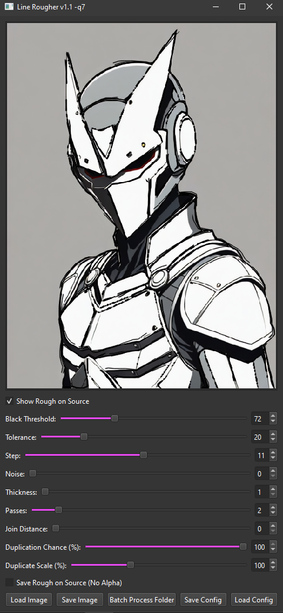

# Line Rougher

_Roughen up these lines!_

## Table of Contents

- [Overview](#overview)
- [Dependencies](#dependencies)
- [Installation](#installation)
- [Usage](#usage)
- [Examples](#examples)
- [License](#license)
- [Contact](#contact)

## Overview

Line Rougher is a tool that converts clean line art into a stylized, scribbled version.



## Dependencies

All dependencies required for Threshold Scribbler will be automatically installed in a Python virtual environment via the provided `install.bat` script:

- opencv-python
- numpy
- PySide6

Additionally, you will need:
- Python 3.10.10 or newer
- Git

## Installation

### Windows

1. **Install Python 3.10.10 or Newer:**  
   [Download Python](https://www.python.org/downloads/release/python-31010/)

2. **Install Git:**  
   [Download Git](https://git-scm.com/downloads)

3. **Clone this Repository:**  
   Open a command prompt and run:
   ```bat
   git clone https://github.com/YourUsername/Threshold-Scribbler.git
   ```

4. **Run the Installation Script:**  
   Navigate into the cloned repository folder and execute `install.bat` to set up the virtual environment and install dependencies:
   ```bat
   cd Threshold-Scribbler
   install.bat
   ```

## Usage

To run the project:

1. **Execute the Run Script:**  
   Simply run `run.bat` from your command prompt or double-click it to launch the application.
   
2. **Adjust Parameters:**  
   Use the provided controls (sliders and input boxes) to adjust the black threshold, tolerance, scribble parameters, and duplication scale. The live preview updates automatically.

3. **Save Output:**  
   Once you’re satisfied with the results, save the processed image. The output PNG will contain only black, semi-transparent black, and fully transparent pixels.

## Examples

Below are some outputs:

https://github.com/user-attachments/assets/9ff18dbe-6c89-4d7d-b722-8cb8efb1c799

## License

This project is licensed under the Apache-2.0 license.

## Contact

For questions, feedback, or contributions, please feel free to open an issue on the repository. -q7
